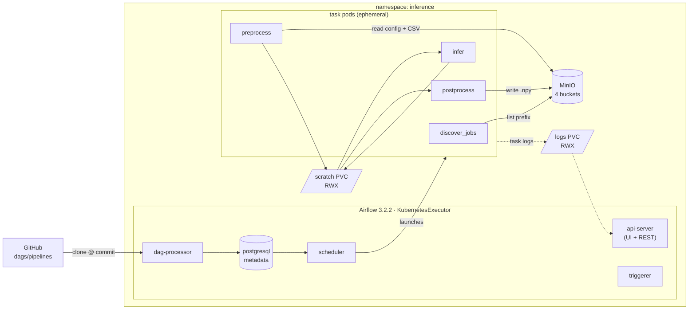

# Batch inference pipeline — Airflow on Kubernetes with MinIO

Apache Airflow 3 orchestrating mocked batch-inference jobs on Minikube. Each job
reads a config and an input CSV from MinIO, runs them through a (mocked) model,
and writes an `(n_rows, 512)` `.npy` of output vectors back to object storage.

The model itself is deliberately fake — a random array of the correct shape.
What is real is the infrastructure around it: how jobs are scheduled, how
workers run in Kubernetes pods, how credentials are scoped, and how you debug it
when something breaks.

---

## Architecture



Two DAG sources, deliberately different in kind:

| Bundle | Source | Versioned? | Holds |
|---|---|---|---|
| `dags-folder` | baked into the Airflow image | no | `00_smoke_test` — infrastructure diagnostic |
| `inference-pipelines` | cloned from git at a commit | **yes** — `dag_run.bundle_version` | the actual pipelines |

The smoke test stays in the image so it keeps working when the git remote is
unreachable; it tells you whether the *cluster* is healthy. The pipelines come
from git so every run records the commit that defined it, and a task pod is
pinned to the commit its run started on — pushing mid-run cannot change what an
in-flight run executes.

---

## Prerequisites

| Tool | Used for |
|---|---|
| `minikube` | the cluster (docker driver) |
| `kubectl` | everything |
| `helm` 3.16+ or 4.x | deploying the umbrella chart (developed on 4.2.4; CI pins 3.16.3) |
| `docker` | building images into minikube's daemon |

No registry account, no `mc`, no `boto3` on your machine. Images are built
straight into minikube's docker daemon and everything that touches MinIO runs
inside the cluster.

---

## Quickstart

```bash
# 0. cluster + hostPath directories with the right ownership
./scripts/0-bootstrap-minikube.sh

# 1. set credentials — the chart ships none, and install fails without them
cp k8s/inference-pipeline/values.local.example.yaml \
   k8s/inference-pipeline/values.local.yaml
#   then edit the three secretKey values; generate with: openssl rand -hex 16

# 2. build both images into minikube's docker daemon
./scripts/1-build-images.sh

# 3. deploy Airflow + MinIO + storage + RBAC as one Helm release
./scripts/2-deploy.sh

# 4. upload sample configs/CSVs to MinIO and set the job-spec Variables
./scripts/3-seed-data.sh

# 5. open the UIs
./scripts/4-port-forward.sh
```

`values.local.yaml` is gitignored. **No password is committed to this
repository**; `helm install` aborts with an explicit message until all three
`secretKey` values are supplied, so a fresh clone cannot come up on well-known
credentials.

---

## Triggering a pipeline

```bash
kubectl -n inference exec deploy/inference-scheduler -c scheduler -- \
  airflow dags trigger protein_embedder

kubectl -n inference exec deploy/inference-scheduler -c scheduler -- \
  airflow dags trigger molecule_embedder
```

Or from the UI at <http://localhost:8080> (`admin` / `admin`) once
`4-port-forward.sh` is running.

**Adding work needs no code change.** A job spec declares an `input_prefix`, and
`discover_jobs` lists it at run time — so dropping another CSV under
`data/inputs/proteins/`, re-running `3-seed-data.sh` and triggering again
produces one more job, with no config or Variable edit.

### What a run does

```
discover_jobs                      one task  — lists the prefix, emits one spec per CSV
  └── run_job[i]                   one mapped TaskGroup per CSV
        ├── preprocess             read config + CSV from MinIO → scratch
        ├── infer                  random (n_rows, 512) float32 → scratch
        └── postprocess            validate shape → publish .npy to MinIO
```

The whole *group* is mapped, not the individual operators. Chaining separately
expanded operators would put a barrier between stages — every `preprocess` in
the DAG finishing before any `infer` starts. Mapping the group gives each job an
independent chain, so a slow job never blocks a fast one.

---

## Observability

### Airflow UI

```bash
./scripts/4-port-forward.sh
```

| | URL | Credentials |
|---|---|---|
| Airflow UI / REST | <http://localhost:8080> | `admin` / `admin` |
| MinIO console | <http://localhost:9001> | from your `values.local.yaml` |
| MinIO S3 API | <http://localhost:9000> | as above |

Every Service is `ClusterIP` — nothing is exposed until you forward it.

### Logs from a specific worker pod

While a task pod is alive:

```bash
# all pods for one DAG
kubectl -n inference get pods -l dag_id=protein_embedder

# follow one pod
kubectl -n inference logs -f <pod-name>

# KubernetesPodOperator job pods carry this label
kubectl -n inference logs -l kubernetes_pod_operator=True --all-containers --tail=100
```

Task pods are deleted when they finish, so **after the fact** the logs come from
the shared RWX logs PVC — which is exactly why that volume exists:

```bash
minikube ssh -- "sudo find /data/inference/airflow-logs \
  -path '*protein_embedder*' -name '*.log'"

minikube ssh -- "sudo cat '/data/inference/airflow-logs/dag_id=protein_embedder/\
run_id=<run-id>/task_id=run_job.infer/attempt=1.log'"
```

The same logs render in the UI. Without that volume a finished task's logs would
die with its pod.

### Which commit produced a run

```bash
kubectl -n inference exec statefulset/inference-postgresql -- \
  env PGPASSWORD=postgres psql -U postgres -d postgres -tA -c \
  "select dag_id, state, bundle_version from dag_run order by start_date desc limit 5;"
```

### Reliability configuration

Set DAG-level in `default_args`, so it covers **every** task including
`discover_jobs`, not just the pod stages:

| Setting | Value |
|---|---|
| `retries` | 2 |
| `retry_delay` | 30s, exponential, capped at 5 min |
| `execution_timeout` | 10 min per task |
| `deadline` | `DeadlineAlert`, 15 min from *queued* |

> **Note on SLAs.** `sla=` still exists as an operator parameter in Airflow
> 3.2.2, but the value is **discarded** and only a `UserWarning` is emitted —
> "The SLA feature is removed in Airflow 3.0, replaced with Deadline Alerts in
> >=3.1". A ported Airflow 2 SLA looks configured and does nothing. This project
> uses `DeadlineAlert` measured from `DAGRUN_QUEUED_AT`, so time spent waiting
> for a free pod slot counts against the deadline.

---

## Security model

**Kubernetes RBAC.** `multiNamespaceMode: false` makes the chart emit a
namespaced `Role`/`RoleBinding` rather than a `ClusterRole`, so the scheduler can
only create pods in its own namespace. The repository adds **zero ClusterRoles**.
Job pods run as `inference-worker`, a ServiceAccount with no bindings and
`automountServiceAccountToken: false` — containers running job logic have no
reason to reach the Kubernetes API.

**MinIO IAM.** Four buckets, two identities, least privilege per verb:

| Identity | configs | inputs | outputs | restricted |
|---|---|---|---|---|
| `inference-worker` | read | read | **write** | **denied** |
| `inference-curator` | – | – | – | read / write |

Enforced, not asserted — `00_smoke_test` **fails its run** if the worker identity
can list `inference-restricted`, so the boundary is checked on every deploy rather
than trusted.

**NetworkPolicy.** A policy restricting ingress to MinIO ships with the chart,
but **minikube's default CNI does not enforce NetworkPolicy** — it is accepted by
the API server and ignored. It documents intent and is enforced on calico or
cilium (`minikube start --cni=calico`). The control that actually enforces
bucket scoping here is MinIO IAM.

---

## Repository layout

```
k8s/inference-pipeline/     umbrella Helm chart; airflow + minio as dependencies
  templates/                RBAC, PVs/PVCs, Secrets, ConfigMap, NetworkPolicy
  values.yaml               single source of truth; Chart.lock pins both subcharts
dags/
  local/                    baked into the image — infrastructure smoke test
  pipelines/                served from git — the actual pipelines
worker/
  Dockerfile                python:3.13-slim + boto3/numpy/PyYAML
  entrypoint.py             one entrypoint, three stages (--stage)
  Dockerfile.airflow        Airflow image with dags/local baked in
data/
  jobs/                     job spec lists → Airflow Variables
  configs/                  model configs → MinIO configs bucket
  inputs/                   sample CSVs → MinIO inputs bucket
tests/                      pytest suite; DAG tests self-skip without Airflow
scripts/                    0-bootstrap → 1-build → 2-deploy → 3-seed → 4-port-forward
requirements-dev.txt        test dependencies, pinned to worker/Dockerfile
```

### Configuration model

Two files, **no field defined twice**:

| File | Owns | Read by |
|---|---|---|
| `data/jobs/*.json` → Airflow Variable | `config_key`, `input_prefix`, `target_bucket` | the DAG, at run time |
| `data/configs/*.yaml` → configs bucket | `model_name`, `batch_size` | the worker |

The spec owns routing; the config owns the model.

---

## Design decisions

**Umbrella chart over separate releases.** One `helm install` deploys the whole
stack and credentials are defined once. The cost is a single namespace: neither
upstream chart lets a subchart target a different one, so one release means one
namespace. A NetworkPolicy replaces the namespace boundary, which is stronger
anyway — namespaces provide no network isolation by default.

**Discovery is a task, not top-level code.** DAG files are re-parsed every 30s.
Reading a Variable or listing S3 at module level would run on *every parse*
inside the dag-processor, so slow MinIO would degrade DAG **parsing**, not just
runs.

**Scratch PVC for inter-stage data.** Each stage is its own pod, sharing no
memory or local disk. Bulk intermediates travel on an RWX volume; only small
metadata goes through XCom, which lives in the metadata database.

**Dependencies baked at image build.** Installing `boto3`/`numpy` at pod start
costs ~15s on every task on every run and makes PyPI a hard runtime dependency
for a pipeline that otherwise only needs MinIO.

---

## Development

```bash
pip install pre-commit && pre-commit install
pre-commit run --all-files

python -m pip install -r requirements-dev.txt
pytest -q                                # 33 tests; DAG tests self-skip
```

`pytest` on its own is not enough: `tests/conftest.py` imports
`worker/entrypoint.py`, which imports `boto3`, `numpy` and `yaml` at module
level. Those are already present inside the Airflow image where CI runs, which
is precisely why the gap is easy to miss locally — hence
`requirements-dev.txt`, pinned to the same versions as `worker/Dockerfile`.

### Tests

| File | Covers |
|---|---|
| `tests/test_entrypoint.py` | worker stage logic — shape invariants, batching edge cases, S3 error translation, refusal to publish a bad array |
| `tests/test_data_fixtures.py` | that the sample data is *wired*: every spec resolves to a real config and real inputs, and every Variable a DAG asks for is one the seed script creates |
| `tests/test_dags.py` | DAG import, stage ordering, retry policy, deadline, and that job pods request the token-less ServiceAccount |

`tests/test_dags.py` needs Airflow, so it skips on a laptop and runs in CI
inside the real `apache/airflow:3.2.2` image — a DAG that imports against some
other Airflow version proves nothing about the one it will run on. The full
suite is 43 tests with Airflow present.

The S3 fake in `conftest.py` is hand-written rather than `moto`: the worker makes
exactly two S3 calls, so a stub keeps the tests about our logic instead of
boto3's, with no extra dependency.

### CI

`.github/workflows/ci.yml`:

| Job | Runs |
|---|---|
| `pre-commit` | the same hooks you run locally, including yamllint over the workflows themselves |
| `hadolint` | both Dockerfiles |
| `helm lint + template` | `dependency build` from Chart.lock, `lint`, `template` → parse, plus a guard that the chart **refuses to render without credentials** |
| `pytest` | the suite inside `apache/airflow:3.2.2`, launched with `docker run` from an ordinary runner |

Changes under `dags/pipelines/` reach Airflow only through the git bundle, so
they must be pushed to the tracked ref (`main`) before the cluster sees them.
Baking them into the image will not work: the git bundle takes precedence.

---

## Known limitations

- **No event-driven trigger.** MinIO can publish object notifications and
  Airflow 3 can consume them via `AssetWatcher`, but the brief specifies reading
  a list of job specs. The webhook design is scoped, not built.
- **Re-running reprocesses everything** under a prefix; outputs overwrite
  idempotently. A skip-if-output-exists check in `discover_jobs` would fix it.
- **Single node.** `ReadWriteMany` works because every pod lands on the same
  kubelet and shares one hostPath. On a multi-node cluster these need a real RWX
  provisioner.
- **`admin`/`admin` for the Airflow UI**, from the chart default. Fine behind a
  port-forward, not fine anywhere else.
